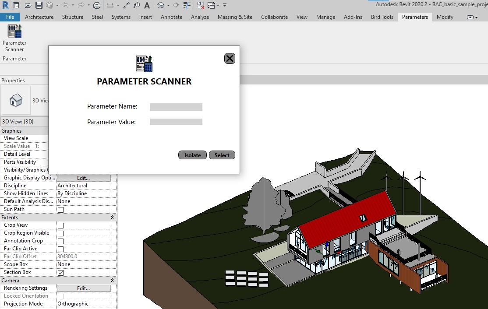

## Description

This is Mariana Menezes' source code for the technical test assignment for the Revit Add-in Developer position at ENG. The installer can be found in the release attachments of this repository or inside the 'Output' file. It's named 'ParameterScannerApp 1.0.0.exe'.

This solution is designed to work with Revit 2020, as specified in the requirements. It's important to note that the tool will only recognize elements whose Parameter Name and Parameter Value exactly match those found in the object. For example, parameter values of ElementId types, such as 'Level' parameters, should have the desired level ElementId as the parameter value, not its name. Also, parameters that are of 'double' type must receive their exact value as input. Parameters values of Yes/No (integer) type must be represented using 0 or 1.

## Development

To complete the assigned task of selecting and isolating Revit elements based on a certain parameter value, I first developed an element filter that encompassed all model instances. From the list of all model instances, I obtained the desired user input 'Parameter Name' and searched for this parameter within all model elements. The result of this action was a dictionary containing the parameter values. Then, using the user input 'Parameter Value', I found all elements whose parameter value was equal to those searched for. From then on, I developed the select and isolate functions.

## Possible improvements

Possible improvements could address the isolation action button on views that do not encompass all model elements. This could involve attaching element isolation only to visible elements on that view. Additionally, the user input for Parameter Name could be made case-insensitive or show similar results. The Parameter Value search could also be enhanced to support formulas, for example, searching for all elements with a Parameter Name of "Area" and a Parameter Value greater than 60 m² (>60).
